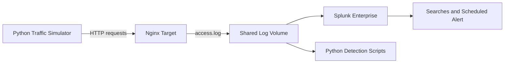

# Splunk Detection Engineering Lab

## Overview

This project is a Docker-based security monitoring lab that simulates suspicious web activity against an Nginx server and analyzes the resulting access logs in Splunk. I built the environment to practice the full SOC workflow: generate activity, collect logs, identify suspicious patterns, write detections, map findings to MITRE ATT&CK, and create a scheduled alert.

The simulated activity is safe and contained inside a local Docker network.

## Project Objectives

- Build a repeatable lab with Docker Compose
- Generate normal and suspicious HTTP traffic with Python
- Ingest Nginx access logs into Splunk
- Detect repeated login failures and web enumeration
- Correlate failed logins followed by a successful login
- Assign severity based on the observed behavior
- Map the activity to MITRE ATT&CK
- Convert an investigation query into a scheduled Splunk alert

## Lab Architecture

| Component | Purpose |
|---|---|
| Nginx target | Receives the simulated web requests and records access logs |
| Python simulator | Generates normal browsing, sensitive-path enumeration, failed logins, and a successful login |
| Splunk Enterprise | Ingests, searches, correlates, and alerts on the Nginx logs |
| Docker Compose | Builds the containers, shared network, ports, and log volumes |
| Python detection scripts | Parse the access log and identify suspicious behavior outside Splunk |



## Simulated Activity

The Python scenario generated two categories of traffic:

1. **Normal browsing** to pages such as `/`, `/about`, `/products`, and `/contact`.
2. **Suspicious behavior**, including requests to sensitive or commonly enumerated paths such as `/admin`, `/login`, `/backup`, `/server-status`, `/phpmyadmin`, `/.env`, and `/config`.

The scenario then generated eight failed login attempts against the `admin` account followed by one successful login. This created a clear pattern for testing both threshold-based and correlation-based detections.

## Detection Logic

### 1. Repeated Failed Logins

The first detection grouped failed login events by source IP address and username. A source with five or more failed attempts was treated as a possible brute-force attack and assigned **High** severity.

### 2. Failed Login Burst Followed by Success

The second detection correlated multiple failures with a later successful login for the same source IP and account. Because this pattern can indicate that an attacker eventually guessed or obtained a valid password, it was assigned **Critical** severity.

### 3. Web Enumeration

The enumeration detection tracked the number of unique sensitive paths requested by one source. Reaching multiple administrative, backup, configuration, or status paths indicated systematic discovery rather than ordinary browsing.

## Splunk Investigation

I first reviewed the raw Nginx events to confirm that the source IP, requested path, username, and login result were present. I then used SPL to extract fields and summarize the activity.

### Failed-login threshold search

```spl
index=main sourcetype="nginx:access" "attempt=failed"
| rex field=_raw "^(?<src_ip>\d+\.\d+\.\d+\.\d+)"
| rex field=_raw "username=(?<user>[^&\s]+)"
| stats count AS failed_attempts BY src_ip user
| where failed_attempts >= 5
| sort - failed_attempts
```

### Failures followed by success

```spl
index=main sourcetype="nginx:access" "/login?username="
| rex field=_raw "^(?<src_ip>\d+\.\d+\.\d+\.\d+)"
| rex field=_raw "username=(?<user>[^&\s]+)"
| rex field=_raw "attempt=(?<result>failed|success)"
| stats count(eval(result="failed")) AS failures
        count(eval(result="success")) AS successes
        earliest(_time) AS first_seen
        latest(_time) AS last_seen
        BY src_ip user
| where failures >= 5 AND successes >= 1
| convert ctime(first_seen) ctime(last_seen)
```

The correlated search returned one source with eight failures and one success against the `admin` account.

## Alert Creation

I saved the correlation search as a scheduled Splunk alert named **Failed Login Burst Followed by Success**. The alert triggers when the search returns at least one result and documents the behavior as MITRE ATT&CK **T1110 – Brute Force**.

In a production environment, the next steps would include validating whether the login was authorized, reviewing the source IP and related account activity, checking for privilege changes or lateral movement, resetting exposed credentials when appropriate, and blocking or containing the source based on the investigation.

## MITRE ATT&CK Mapping

| Observed behavior | MITRE ATT&CK mapping | Reasoning |
|---|---|---|
| Repeated failed login attempts | T1110 – Brute Force | Repeated attempts may indicate password guessing |
| Sensitive-path enumeration | T1595 – Active Scanning | The source probes multiple paths to discover exposed resources |

The lab models behaviors associated with these techniques; it does not reproduce a real compromise.

## Evidence

### Docker services running


### Raw Nginx events ingested into Splunk


### Failed-login threshold detection


### Failed logins correlated with a successful login


### MITRE ATT&CK research


### Scheduled Splunk alert


## Skills Demonstrated

- Splunk Search Processing Language (SPL)
- Log ingestion and analysis
- Detection engineering fundamentals
- Event correlation and threshold tuning
- SOC investigation and severity assessment
- Python scripting and regular expressions
- Docker and Docker Compose
- Nginx access-log analysis
- MITRE ATT&CK mapping
- Alert creation and documentation

## Lessons Learned

This project showed me that one event may not be meaningful by itself. The useful detection came from combining repeated authentication failures, the source IP, the targeted username, and the later successful login. I also learned that a search becomes operationally useful only after its logic, threshold, severity, and response steps are clearly defined.

## Security Notes

- All traffic was simulated in an isolated local lab.
- No real credentials, targets, or production systems were used.
- Secrets and local passwords should be stored in environment variables or a local `.env` file that is excluded from Git before publishing the project.
